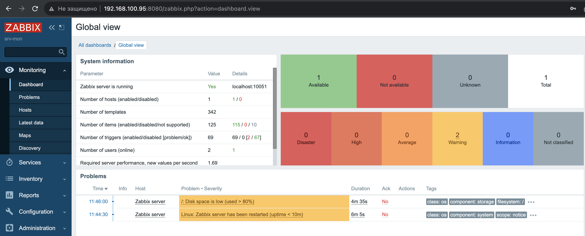
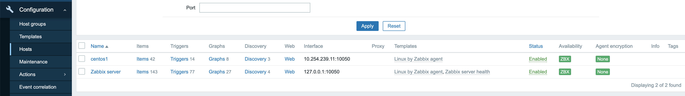
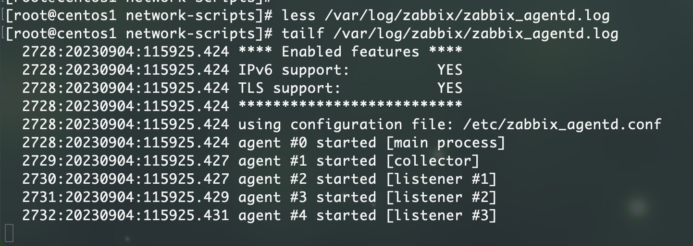
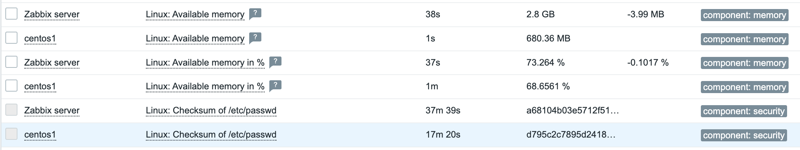

# Домашнее задание к занятию «Система мониторинга Zabbix»

В практике есть 2 основных и 1 дополнительное (со звездочкой) задания. Первые два нужно выполнять обязательно, третье - по желанию и его решение никак не повлияет на получение вами зачета по этому домашнему заданию, при этом вы сможете глубже и/или шире разобраться в материале. 

Пожалуйста, присылайте на проверку всю задачу сразу. Любые вопросы по решению задач задавайте в чате учебной группы.

### Цели задания
1. Научиться устанавливать Zabbix Server c веб-интерфейсом
2. Научиться устанавливать Zabbix Agent на хосты
3. Научиться устанавливать Zabbix Agent на компьютер и подключать его к серверу Zabbix 

### Чеклист готовности к домашнему заданию
- [ ] Просмотрите в личном кабинете занятие "Система мониторинга Zabbix" 

---

### Задание 1 

Установите Zabbix Server с веб-интерфейсом.

#### Процесс выполнения
1. Выполняя ДЗ, сверяйтесь с процессом отражённым в записи лекции.
2. Установите PostgreSQL. Для установки достаточна та версия, что есть в системном репозитороии Debian 11.
3. Пользуясь конфигуратором команд с официального сайта, составьте набор команд для установки последней версии Zabbix с поддержкой PostgreSQL и Apache.
4. Выполните все необходимые команды для установки Zabbix Server и Zabbix Web Server.

#### Требования к результаты 
1. Прикрепите в файл README.md скриншот авторизации в админке.
2. Приложите в файл README.md текст использованных команд в GitHub.

### Ответ на задание 1.

1. Скриншот авторизации в админке:


2. Список команд:
```bash
 1008  apt install postgresql
 1009  wget https://repo.zabbix.com/zabbix/6.0/debian/pool/main/z/zabbix-release/zabbix-release_6.0-5+debian12_all.deb
 1010  dpkg -i zabbix-release_6.0-5+debian12_all.deb
 1011  apt update
 1012  apt install zabbix-server-pgsql zabbix-frontend-php php8.2-pgsql zabbix-nginx-conf zabbix-sql-scripts zabbix-agent
 1013  sudo -u postgres createuser --pwprompt zabbix
 1014  cd ~
 1015  sudo -u postgres createuser --pwprompt zabbix
 1016  cd tmp
 1017  cd /tmp/
 1018  sudo -u postgres createuser --pwprompt zabbix
 1019  sudo -u postgres createdb -O zabbix zabbix
 1020  zcat /usr/share/zabbix-sql-scripts/postgresql/server.sql.gz | sudo -u zabbix psql zabbix
 1021  vim /etc/zabbix/zabbix_server.conf 
 1022  systemctl start zabbix_server
 1023  systemctl start zabbix-server
 1024  systemctl status zabbix-server
 1025  netstat -puntal | grep 443
 1026  systemctl restart zabbix-server zabbix-agent nginx php8.2-fpm
```
---

### Задание 2 

Установите Zabbix Agent на два хоста.

#### Процесс выполнения
1. Выполняя ДЗ, сверяйтесь с процессом отражённым в записи лекции.
2. Установите Zabbix Agent на 2 вирт.машины, одной из них может быть ваш Zabbix Server.
3. Добавьте Zabbix Server в список разрешенных серверов ваших Zabbix Agentов.
4. Добавьте Zabbix Agentов в раздел Configuration > Hosts вашего Zabbix Servera.
5. Проверьте, что в разделе Latest Data начали появляться данные с добавленных агентов.

#### Требования к результаты 
1. Приложите в файл README.md скриншот раздела Configuration > Hosts, где видно, что агенты подключены к серверу
2. Приложите в файл README.md скриншот лога zabbix agent, где видно, что он работает с сервером
3. Приложите в файл README.md скриншот раздела Monitoring > Latest data для обоих хостов, где видны поступающие от агентов данные.
4. Приложите в файл README.md текст использованных команд в GitHub


### Ответ на задание 2.
1. Скриншот вкладки Configuration->Hosts:


2. Скриншот лога без ошибок:


3. Последнее время обновления данных:


4. Список команд по установке агента:
```bash
  117  yum install zabbix-agent
  118  sestatus 
  119  vim /etc/zabbix_agentd.conf 
  120  systemctl status zabbix_agent
  121  systemctl status zabbix-agent
  122  systemctl start zabbix-agent
  123  systemctl status zabbix-agent
  124  hostname
  125  ifconfig 
  126  firewall-cmd --list
  127  firewall-cmd --list-all
  128  firewall-cmd --list-services
  129  firewall-cmd --add
  130  firewall-cmd --add-service=zabbix-agent
  131  firewall-cmd --add-service=zabbix-agent --permanent
  132  firewall-cmd --list-services
  133  tailf /var/log/zabbix/zabbix_agentd.log 
  134  systemctl restart zabbix-agent
  135  less /var/log/zabbix/zabbix_agentd.log 
  136  vim /etc/zabbix_agentd.conf 
  137  systemctl restart zabbix-agent
  138  less /var/log/zabbix/zabbix_agentd.log 
  139  tailf /var/log/zabbix/zabbix_agentd.log 
```
---
## Задание 3 со звёздочкой*
Установите Zabbix Agent на Windows (компьютер) и подключите его к серверу Zabbix.

#### Требования к результаты 
1. Приложите в файл README.md скриншот раздела Latest Data, где видно свободное место на диске C:
--- 

## Критерии оценки

1. Выполнено минимум 2 обязательных задания
2. Прикреплены требуемые скриншоты и тексты 
3. Задание оформлено в шаблоне с решением и опубликовано на GitHub
